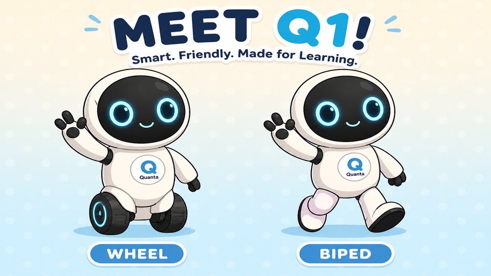
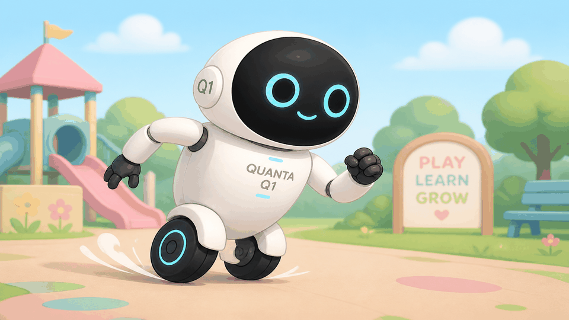
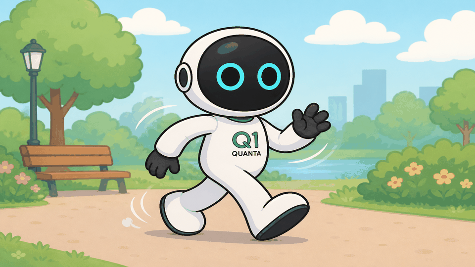
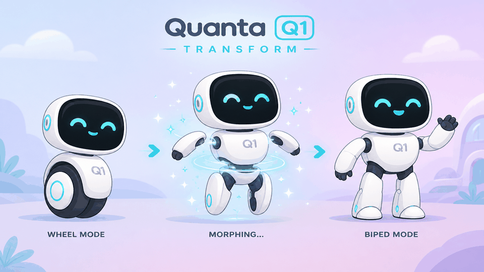
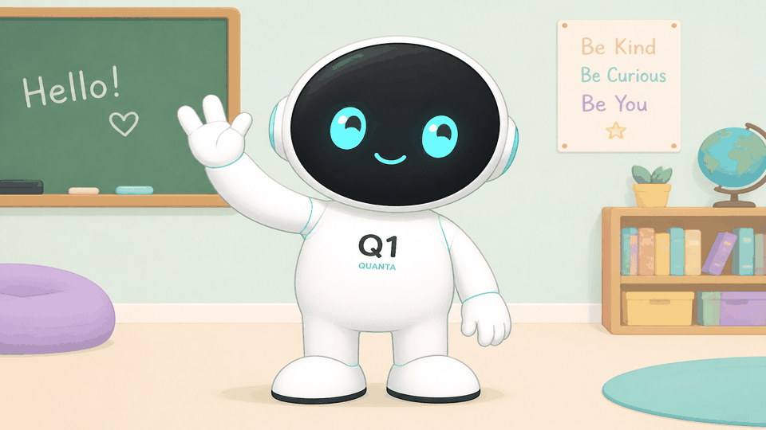
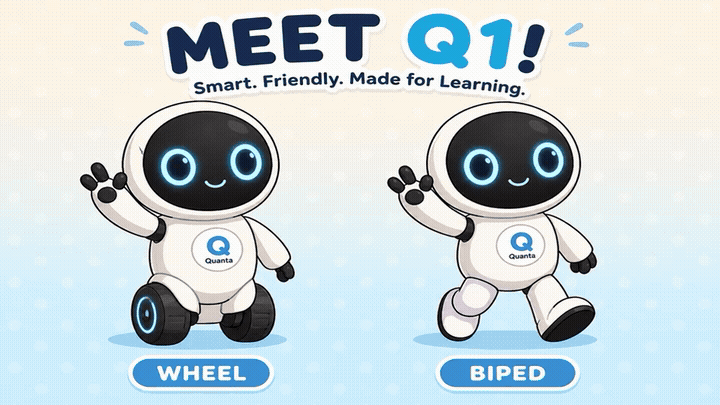
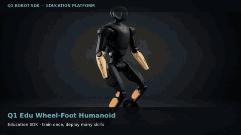

<p align="center">
  
</p>

<h1 align="center">Q1 Robot SDK</h1>

<p align="center">
  <em>A transformable wheel-foot education humanoid — cartoon-friendly, RL-ready, Quanta native.</em>
</p>

<p align="center">
  <a href="docs/develop_guide/index.md"><b>Develop guide</b></a> ·
  <a href="playground/web/index.html">MuJoCo playground</a> ·
  <a href="docs/roadmap.md">Roadmap</a> ·
  <a href="docs/architecture.md">Architecture</a> ·
  <a href="colab/q1_mujoco_playground_wheel_train.ipynb">Colab train</a>
</p>

<p align="center">
  
  
  
</p>

---

**This repo is Q1’s public brain.** Designed and manufactured by **Quanta Computer** (MIT Taiwan): soft white skinsuit, matte **black dual-cam head**, **QDD** actuators, **3-finger** hand, and feet that switch between **wheels** and **biped**.

Schools train once in the Edu path; customers fine-tune for home clean/organize, logistics, sports, calligraphy, and piano.

> **Status:** Pre-SDK (v0.x) — API surface, docs, playground, CES 2027 wheeled track.  
> **Target:** Official SDK + physical EDU deploy when units ship.

## It does things

<table>
<tr>
<td width="50%" align="center">
  
</td>
<td width="50%" align="center">
  
</td>
</tr>
<tr>
<td><b>It rolls.</b> Wheel mode — drive forward / back with <code>LocoClient</code>.</td>
<td><b>It walks.</b> Biped mode — same body, flat feet, step cycle.</td>
</tr>
<tr>
<td width="50%" align="center">
  
</td>
<td width="50%" align="center">
  
</td>
</tr>
<tr>
<td><b>It transforms.</b> Wheel ↔ biped at the ankles — one morphology, two brains.</td>
<td><b>It waves hello.</b> Basic upper-body action for classroom bring-up.</td>
</tr>
<tr>
<td width="50%" align="center">
  
</td>
<td width="50%" align="center">
  
</td>
</tr>
<tr>
<td><b>It grasps.</b> 3-finger hand packs — ball, brush, keys.</td>
<td><b>Wheel + biped.</b> One cartoon Q1, two locomotion modes.</td>
</tr>
</table>

MP4 versions of each basic action (for download / embedding):

| Action | GIF | MP4 |
|--------|-----|-----|
| Roll | [`q1_basic_roll.gif`](media/cartoon/q1_basic_roll.gif) | [`q1_basic_roll.mp4`](media/cartoon/q1_basic_roll.mp4) |
| Walk | [`q1_basic_walk.gif`](media/cartoon/q1_basic_walk.gif) | [`q1_basic_walk.mp4`](media/cartoon/q1_basic_walk.mp4) |
| Transform | [`q1_basic_transform.gif`](media/cartoon/q1_basic_transform.gif) | [`q1_basic_transform.mp4`](media/cartoon/q1_basic_transform.mp4) |
| Wave | [`q1_basic_wave.gif`](media/cartoon/q1_basic_wave.gif) | [`q1_basic_wave.mp4`](media/cartoon/q1_basic_wave.mp4) |
| Grasp | [`q1_basic_grasp.gif`](media/cartoon/q1_basic_grasp.gif) | [`q1_basic_grasp.mp4`](media/cartoon/q1_basic_grasp.mp4) |

<details>
<summary>Photoreal concept demo (legacy)</summary>

<p align="center">
  
</p>

[▶ Full MP4](media/q1_edu_wheel_demo.mp4) · [Use-case guide](docs/develop_guide/10_use_cases.md)

</details>

## Where to find things

### You want to play

| | |
|---|---|
| [Browser playground](playground/web/index.html) | Keyboard: `W/S` drive, `A/D` turn, `T` transform |
| [MuJoCo keyboard demo](playground/mujoco_keyboard_demo.py) | Local physics + headless recording |
| [Colab wheel train](colab/q1_mujoco_playground_wheel_train.ipynb) | Structure → URDF/MJCF → PPO forward/back |
| [Cartoon media](media/cartoon/) | Homepage mascot + basic-action loops |

### You are building

| | |
|---|---|
| [Develop guide](docs/develop_guide/index.md) | DDS · ROS 2 · API · motion · RL · Sim2Sim · Sim2Real |
| [Architecture](docs/architecture.md) | Processes, domains, safety leases |
| [Roadmap](docs/roadmap.md) | Wheeled this year → biped + hand next |
| [Models](models/q1/) | MJCF / URDF wheel-foot |

## Under the hood

| Layer | What you get |
|-------|----------------|
| **DDS** | Real-time `rt/*` topics for lowcmd / lowstate / wheel odom |
| **High-level API** | `LocoClient`, `ArmClient`, `InteractionClient` |
| **ROS 2** | `q1_msgs`, `q1_driver`, `q1_bringup`, teleop |
| **RL / AI** | `q1_rl_gym` — Train → Play → Sim2Sim → Sim2Real |
| **Manufacture** | Quanta Computer · MIT Taiwan native design |

## MuJoCo playground (keyboard)

```bash
python3 -m venv .venv
source .venv/bin/activate
pip install -r playground/requirements.txt
python playground/mujoco_keyboard_demo.py
```

| Key | Action |
|-----|--------|
| `W` / `S` | Forward / backward |
| `A` / `D` | Turn |
| `T` | Toggle wheel ↔ biped |
| `1` / `2` | Wheel / biped |
| `R` | Reset |

## Product timeline

```text
2026-10  Pre-SDK releases begin (API skeleton + use-case demos)
2026-Q4  Wheeled locomotion + interaction action packs
2027-01  CES 2027 dual-wheel showcase
2027     Official SDK 1.0 — deploy to physical Q1 EDU
2027+    Biped platform + dexterous hand SDK track
```

## Repository layout

```text
q1_robot_sdk/
├── include/q1/          # C++ headers (channel, clients, IDL stubs)
├── python/q1_sdk/       # Python client (pre-SDK)
├── example/             # Hello world, high/low level, use cases
├── ros2/                # ROS 2 packages
├── rl/                  # RL gym + deploy
├── playground/          # MuJoCo + browser demos
├── models/q1/           # URDF / MJCF
├── media/cartoon/       # Cartoon homepage + basic-action loops
├── colab/               # Colab MuJoCo train notebook
├── docs/develop_guide/  # Full developer curriculum
└── assets/              # Structure URDF/MJCF helpers
```

## Environment

| Item | Recommendation |
|------|----------------|
| OS | Ubuntu 22.04 LTS |
| Arch | x86_64, aarch64 |
| C++ | C++17, CMake ≥ 3.16 |
| Python | 3.10+ |
| ROS 2 | Humble (primary) |
| DDS | CycloneDDS (domain `0`) |

```bash
sudo apt-get update
sudo apt-get install -y cmake g++ build-essential \
  libeigen3-dev libyaml-cpp-dev python3-pip python3-venv
```

## Build (C++ examples)

```bash
git clone https://github.com/willnien10005914/q1_robot_sdk.git
cd q1_robot_sdk
mkdir build && cd build
cmake .. -DBUILD_EXAMPLES=ON
make -j$(nproc)
```

## Python quickstart

```bash
cd python
python3 -m venv .venv && source .venv/bin/activate
pip install -e .
python -c "from q1_sdk import LocoClient; print(LocoClient.__doc__)"
```

## Hello motion (high-level)

```python
from q1_sdk import LocoClient, InteractionClient

loco = LocoClient(iface="eth0")
loco.standby()
loco.set_velocity(vx=0.15, vy=0.0, vyaw=0.0, duration=1.5)

ix = InteractionClient(iface="eth0")
ix.play_action("wave_hello")
```

## Safety (always on)

- Deadman / soft-estop on wireless + DDS heartbeat timeout (default 500 ms).
- Kid-interaction packs clamp end-effector speed and contact force.
- Low-level `rt/lowcmd` requires an explicit `SwitchToUserCtrl` lease.

## A note on ducks

Inspired by friendly open robot showcases (hello, [Microduck](https://github.com/pollen-robotics/microduck)) — Q1 keeps the same spirit: small enough to love, serious enough to train.

## License

Apache-2.0 — see [LICENSE](LICENSE).
