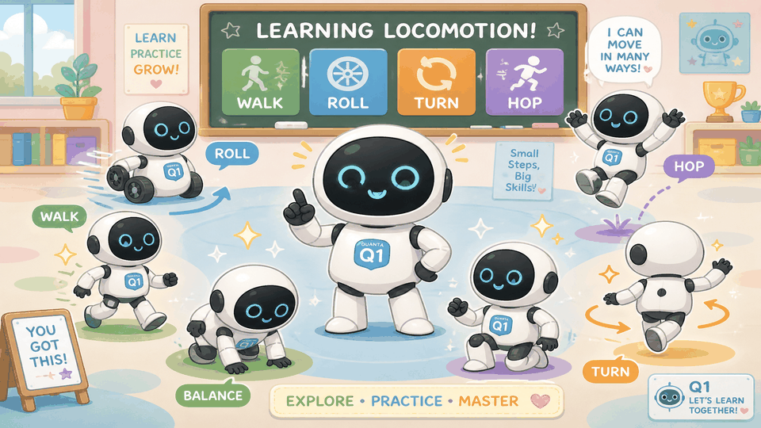
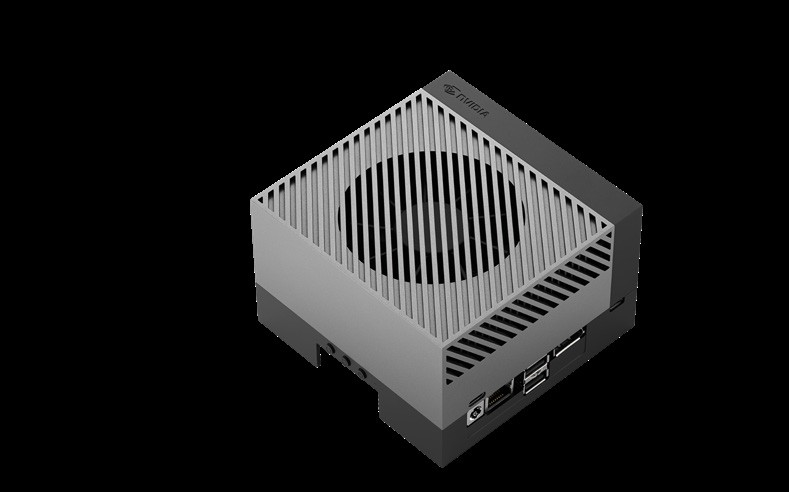
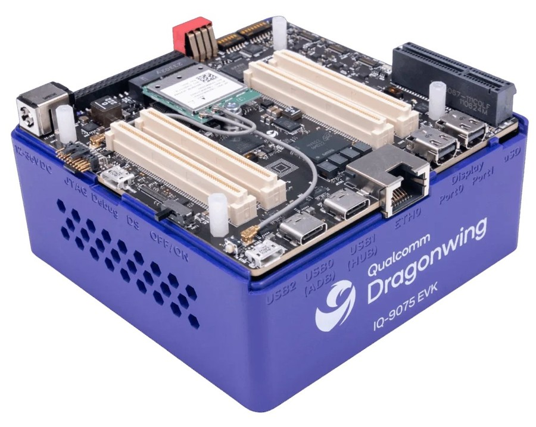
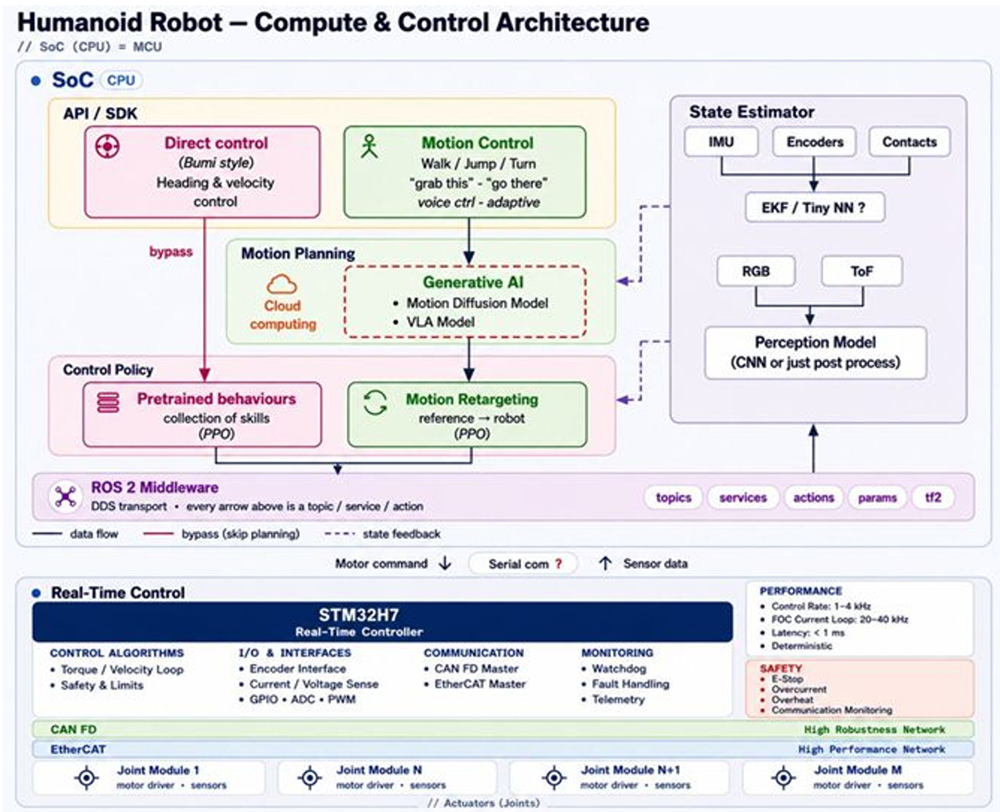

<p align="center">
  
</p>

# Q1 Robot SDK

**Q1** is a transformable wheel-foot humanoid from **Quanta Computer** (MIT Taiwan). This repository is the public **Education-edition SDK** for secondary development: DDS realtime bus, high-level clients, ROS 2, **PPO** RL (Train→Play→Sim2Sim→Sim2Real), and **VLA** (Vision–Language–Action) hooks.


> **Status:** Pre-SDK architecture (v0.x) — API surface, docs, examples, and CES 2027 wheeled roadmap.  
> **Target:** Official SDK + physical deploy when Education units ship.  
> **CES goal:** Dual-wheel Q1 demo track for **CES 2027**.

## Standard vs Education

| | **Standard** | **Education** (developer edition) |
|--|--------------|-----------------------------------|
| Motor parameters | Locked | Tunable (gains / limits / clamps) |
| Motion | Predefined actions / motions only | Custom control + new skills |
| Low-level API | Not exposed | `UserCtrl` lease → `rt/lowcmd` / `rt/lowstate` |
| RL | Factory policy playback | **PPO** train new loco / manip skills |
| VLA | Optional demos only | Fine-tune & deploy Vision–Language–Action policies |

Full matrix: [docs/editions.md](docs/editions.md). This SDK documents the **Education** track.

## Concept demo (Education wheel-foot Q1)

Consistent **Quanta Computer** native design: matte **black dual-camera head**, soft fabric skinsuit, **QDD series** actuators, **3-finger dexterous hand**, and **wheel ↔ biped** transformable feet. The Education edition unlocks motor-parameter access, PPO skill training, and VLA pipelines so partners can build secondary applications (home clean/organize, logistics, sports, calligraphy, piano, and more).


<p align="center">
  
</p>

### Cartoon modes

<table>
<tr>
<td width="50%" align="center">
  
</td>
<td width="50%" align="center">
  
</td>
</tr>
<tr>
<td><b>It transforms.</b> Ankle reconfiguration between wheel drive and biped feet.</td>
<td><b>It learns locomotion.</b> Education edition: PPO / VLA train wheel, walk, hop, turn, and more.</td>
</tr>
</table>

| Scene | Skill path |
|-------|------------|
| Wheel ↔ Biped transform | Native wheel-foot reconfiguration |
| Wheel-foot mobility | `LocoClient` + **QDD** joint torque / wheel roll |
| Lab bring-up | SDK install, teleop, mock → real bus |
| Secondary development | Tune motors · PPO new skills · VLA policies |
| Home clean & organize | Partner-trained household pack |
| Logistics & cargo | Carry / last-meter transport pack |
| Performance sports | **3-finger** soft-ball toss / play demos |
| Calligraphy | **3-finger** brush cultural pack |
| Piano | **3-finger** music demo pack |

| Layer | What you get |
|-------|----------------|
| **DDS** | Real-time `rt/*` topics for lowcmd / lowstate / wheel odom |
| **High-level API** | `LocoClient`, `ArmClient`, `InteractionClient` (JSON request/response over DDS) |
| **ROS 2** | `q1_msgs`, `q1_driver`, `q1_bringup`, teleop nodes |
| **Basic motion** | Wheel-foot loco + **QDD** joint control, soft-stop, arm trajectories |
| **Dexterous hand** | 3-finger end-effector API (grasp / brush / key press) |
| **Manufacture** | **Quanta Computer** · MIT Taiwan native design |
| **RL / AI** | `q1_rl_gym` — PPO · **Isaac Sim** · **Isaac Lab** · MuJoCo playground |
| **VLA** | Vision–Language–Action adapters (obs → language goal → action) |
| **Onboard SoC** | **2026:** Jetson AGX Orin EVK · **2027:** Qualcomm IQ9 low-cost EVK track |
| **Use cases** | Education-edition train → deploy custom packs |

---

## Simulation & training stacks

Education SDK training is not limited to MuJoCo. We also support:

| Stack | Role |
|-------|------|
| **MuJoCo playground** | Fast keyboard bring-up + Colab PPO experiments |
| **NVIDIA Isaac Sim** | High-fidelity sim, sensors, domain randomization |
| **NVIDIA Isaac Lab** | RL / imitation training workflows (PPO and related) on Isaac |
| **VLA fine-tune** | Vision–language–action policies → deploy on Education hardware |

Typical path: train in Isaac Lab / MuJoCo → Sim2Sim → Sim2Real on the onboard SoC below.

---

## Onboard AI compute (Education SoC roadmap)

Education units ship with an edge AI SoC for onboard PPO / VLA inference and fine-tune assist. **2026** Education uses **NVIDIA Jetson AGX Orin**; a **lower-cost Qualcomm IQ9** track is planned for **2027**.

<table>
<tr>
<td width="50%" align="center">
  
</td>
<td width="50%" align="center">
  
</td>
</tr>
<tr>
<td align="center"><b>2026 — Jetson AGX Orin EVK</b><br>
<a href="https://marketplace.nvidia.com/en-us/enterprise/robotics-edge/jetson-agx-orin-developer-kit/">Jetson AGX Orin Developer Kit</a></td>
<td align="center"><b>2027 plan — Qualcomm IQ9 (IQ-9075 EVK)</b><br>
<a href="https://www.qualcomm.com/developer/hardware/qualcomm-iq-9075-evaluation-kit-evk">Qualcomm IQ-9075 Evaluation Kit</a></td>
</tr>
</table>

| | **AGX Orin EVK** (Education now / 2026) | **Qualcomm IQ9 / IQ-9075 EVK** (2027 plan) |
|--|------------------------------------------|---------------------------------------------|
| Role on Q1 | Current Education onboard AI compute | Lower-cost Education / volume track |
| Vendor AI rating | Up to **275 TOPS** (sparse INT8, vendor spec) | Up to **100 dense TOPS** NPU (~**200** sparse-equivalent, vendor spec) |
| AI engines | Ampere GPU + Tensor Cores + NVDLA / PVA | Hexagon NPU (+ GPU assist) |
| Power class | ~15–60 W configurable | Industrial edge / lower BOM target |
| Sim / train host | Isaac Sim · Isaac Lab · MuJoCo (PC/GPU) | Same host stacks; deploy runtime on IQ9 |
| Status | **Shipping path for 2026 Education** | **Roadmap — low-cost SKU planned 2027** |

> TOPS figures are **vendor-published** and use different sparsity conventions — use them as order-of-magnitude guidance, not a 1:1 benchmark.

---

## System architecture diagram

Q1 Education compute & control stack: SoC (API / planning / VLA / PPO policies / state estimation / ROS 2) → serial link → real-time MCU (STM32H7-class) → CAN FD / EtherCAT → joint modules.

<p align="center">
  
</p>

| Block | Role |
|-------|------|
| **SoC (CPU)** | Direct / motion control APIs, generative AI (motion diffusion · VLA), PPO pretrained behaviors & retargeting, state estimator, ROS 2 (DDS) |
| **Serial link** | Motor commands down · sensor data up (SoC ↔ real-time controller) |
| **Real-time controller** | Torque/velocity loops, safety limits, CAN FD / EtherCAT master, 1–4 kHz control / 20–40 kHz FOC |
| **Actuators** | Joint modules on CAN FD (robust) and/or EtherCAT (high performance) |

Details: [docs/architecture.md](docs/architecture.md).

---

## MuJoCo playground (keyboard)

Interactive demo of the Q1 URDF/MJCF with **wheel ↔ biped transform** and drive.

### Browser (GitHub Pages)

Open [`playground/web/index.html`](playground/web/index.html) (or the GitHub Pages site) and click the canvas:

| Key | Action |
|-----|--------|
| `W` / `S` | Forward / backward |
| `A` / `D` | Turn |
| `T` | Toggle wheel ↔ biped |
| `1` / `2` | Wheel / biped |
| `R` | Reset |

### Local MuJoCo physics

```bash
python3 -m venv .venv
source .venv/bin/activate
pip install -r playground/requirements.txt
python playground/mujoco_keyboard_demo.py
```

Headless recording:

```bash
MUJOCO_GL=egl python playground/mujoco_keyboard_demo.py \
  --headless-demo media/playground/q1_mujoco_keyboard_demo.mp4
```

Models:
- MJCF: [`models/q1/q1_wheel_foot.xml`](models/q1/q1_wheel_foot.xml)
- URDF: [`models/q1/q1_wheel_foot.urdf`](models/q1/q1_wheel_foot.urdf)

---

## Quick links

- **[SDK Develop Guide](docs/develop_guide/index.md)** — start here (ROS · DDS · API · motion · RL · VLA · Sim2Sim · Sim2Real)
- **[Standard vs Education](docs/editions.md)** — motor unlock, PPO, VLA matrix
- **[Roadmap & Milestones](docs/roadmap.md)** — wheeled (this year) → biped + dexterous hand (next year)
- **[Architecture](docs/architecture.md)** — process layout, domains, safety · [system diagram](media/architecture/q1_compute_control_architecture.png)
- **[GitHub Milestones](https://github.com/willnien10005914/q1_robot_sdk/milestones)** — tracked release gates
- **[Colab wheel train](colab/q1_mujoco_playground_wheel_train.ipynb)** — structure → URDF/MJCF → PPO forward/back

---

## Product timeline

```text
2026-10  Pre-SDK releases begin (API skeleton + use-case demos)
2026-Q4  Wheeled loco + packs; Education onboard = Jetson AGX Orin EVK
2026     Isaac Sim / Isaac Lab + MuJoCo training path documented
2027-01  CES 2027 dual-wheel showcase
2027     Official SDK 1.0 — physical Q1 Education (Orin)
2027+    Qualcomm IQ9 low-cost Education track · biped + hand + VLA
```

---

## Repository layout

```text
q1_robot_sdk/
├── include/q1/          # C++ headers (channel, clients, IDL stubs)
├── python/q1_sdk/       # Python client (pre-SDK)
├── example/             # Hello world, high/low level, use cases
├── ros2/                # ROS 2 packages
├── rl/                  # PPO gym + deploy (sim2sim / sim2real)
├── playground/          # MuJoCo + browser demos
├── models/q1/           # URDF / MJCF
├── media/               # Concept demo + cartoon homepage loops
├── colab/               # Colab MuJoCo train notebook
├── docs/develop_guide/  # Full developer curriculum
└── assets/              # Structure URDF / MJCF helpers
```

---

## Environment

| Item | Recommendation |
|------|----------------|
| OS | Ubuntu 22.04 LTS (20.04 compatible for DDS examples) |
| Arch | x86_64, aarch64 |
| C++ | C++17, CMake ≥ 3.16, gcc ≥ 9 |
| Python | 3.10+ |
| ROS 2 | Humble (primary), Jazzy optional |
| DDS | CycloneDDS (default domain `0` for robot bus) |

```bash
# System deps (Ubuntu)
sudo apt-get update
sudo apt-get install -y cmake g++ build-essential \
  libeigen3-dev libyaml-cpp-dev python3-pip python3-venv
```

---

## Build (C++ examples)

```bash
git clone https://github.com/willnien10005914/q1_robot_sdk.git
cd q1_robot_sdk
mkdir build && cd build
cmake .. -DBUILD_EXAMPLES=ON
make -j$(nproc)
```

Pre-SDK note: the shared library is header-first / stub-backed until hardware bring-up. Examples compile against the public API and a local mock channel for CI.

---

## Python quickstart

```bash
cd python
python3 -m venv .venv && source .venv/bin/activate
pip install -e .
python -c "from q1_sdk import LocoClient; print(LocoClient.__doc__)"
```

---

## Hello motion (high-level)

```cpp
#include <q1/robot/loco/loco_client.hpp>

int main() {
  q1::ChannelFactory::Instance()->Init(/*domain*/0, "eth0");
  q1::robot::LocoClient loco;
  loco.Init();
  loco.SetTimeout(5.f);
  loco.Standby();                 // soft hold
  loco.SetVelocity(0.2f, 0.f, 0.3f, /*duration*/2.f);  // vx, vy, yaw
  loco.StopMove();
  return 0;
}
```

```python
from q1_sdk import LocoClient, InteractionClient

loco = LocoClient(iface="eth0")
loco.standby()
loco.set_velocity(vx=0.15, vy=0.0, vyaw=0.0, duration=1.5)

ix = InteractionClient(iface="eth0")
ix.play_action("soft_baseball_toss")  # predefined pack (also available on Standard)
```

---

## Develop Guide map (Education edition)

Developer on-ramp for the Education SDK:

| Chapter | Topic |
|---------|-------|
| 1 | [Getting started](docs/develop_guide/01_getting_started.md) |
| 2 | [DDS bus & topics](docs/develop_guide/02_dds.md) |
| 3 | [ROS 2 integration](docs/develop_guide/03_ros.md) |
| 4 | [High / low-level API](docs/develop_guide/04_api.md) |
| 5 | [Basic motion](docs/develop_guide/05_basic_motion.md) |
| 6 | [Reinforcement learning (PPO)](docs/develop_guide/06_rl.md) |
| 7 | [AI training & VLA](docs/develop_guide/07_ai_training.md) |
| 8 | [Sim-to-Sim](docs/develop_guide/08_sim_to_sim.md) |
| 9 | [Sim-to-Real](docs/develop_guide/09_sim_to_real.md) |
| 10 | [Use cases](docs/develop_guide/10_use_cases.md) (piano · calligraphy · soft baseball) |

---

## Safety (always on)

- Deadman / soft-estop on wireless + DDS heartbeat timeout (default 500 ms).
- Interaction packs clamp end-effector speed and contact force estimates.
- Low-level `rt/lowcmd` requires an explicit `SwitchToUserCtrl` lease (**Education** only).

---

## License

Apache-2.0 — see [LICENSE](LICENSE).
